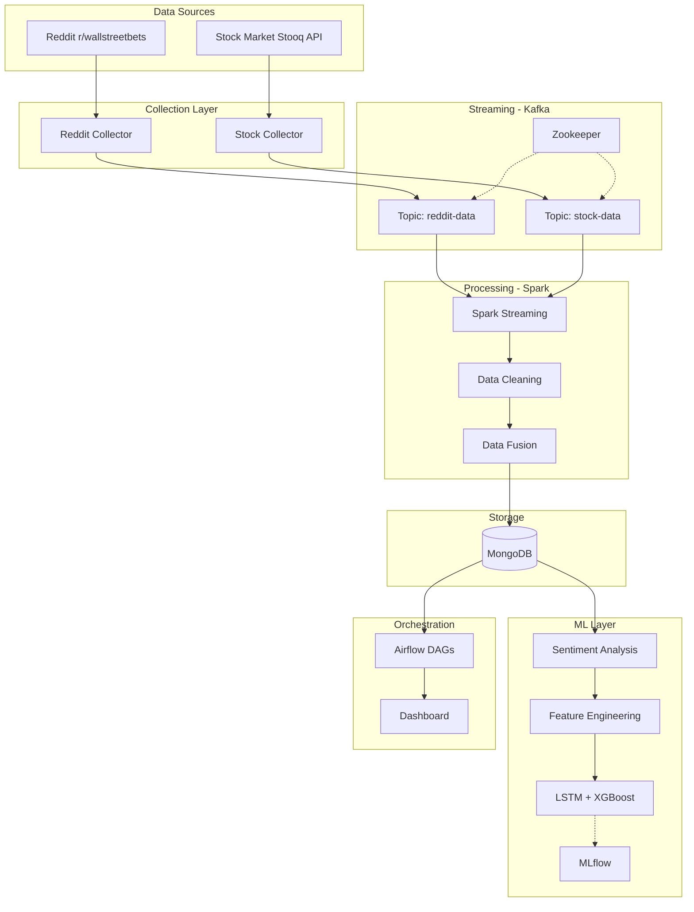

# Stock Market Prediction using Big Data & Sentiment Analysis

Real-time stock market prediction system using Reddit sentiment analysis and financial data.

---

## 👥 Team Members
- **Membre 1**: Data Collection Engineer
- **Membre 2**: Data Processing Engineer  
- **Membre 3**: ML Engineer
- **Membre 4**: Integration Engineer

---

## 🛠️ Tech Stack
- **Streaming**: Kafka, Zookeeper
- **Processing**: Spark
- **Storage**: MongoDB
- **ML Ops**: Airflow, MLflow, DVC
- **Deployment**: Docker & Docker Compose
- **Language**: Python 3.9+, TensorFlow

---

## 🏗️ Architecture

### System Overview


### Data Pipeline


---

## ✅ Project Status

### Completed
- ✅ Docker infrastructure setup (Kafka, Spark, MongoDB, Airflow, MLflow)
- ✅ Data collection scripts (Stock: Stooq API, Reddit: Web scraping)
- ✅ Historical data downloaded (Jan-Jun 2021, GME squeeze period)
- ✅ Kafka topics configured (reddit-data, stock-data)
- ✅ Data verification and preparation scripts

### In Progress
- 🔄 Spark streaming consumer (Membre 2)
- 🔄 Data cleaning pipeline (Membre 2)
- 🔄 Sentiment analysis (Membre 3)
- 🔄 ML model training (Membre 3)
- 🔄 Airflow DAGs (Membre 4)
- 🔄 Dashboard (Membre 4)

---

## 🚀 Quick Start

### Start Infrastructure
```bash
docker-compose up -d
```

### Download Data

**Stock Data** (automated):
```bash
python data_collection/download_stock_stooq.py
```

**Reddit Data** (manual):
1. Download from [Kaggle](https://www.kaggle.com/datasets/gpreda/reddit-wallstreetsbets-posts)
2. Extract and place `reddit_wsb.csv` in `data/raw/`

### Verify Setup
```bash
python data_collection/verify_datasets.py
```

### Initialize Kafka
```bash
./init-kafka.sh
```

---

## 🌐 Service URLs

| Service | URL | Credentials |
|---------|-----|-------------|
| Airflow | http://localhost:8081 | admin / admin |
| MLflow | http://localhost:5000 | - |
| Spark | http://localhost:8080 | - |
| Kafka | localhost:29092 | - |
| MongoDB | localhost:27017 | - |

---

## 📁 Project Structure

```
├── data_collection/          # Reddit & Stock collectors
├── data_processing/          # Spark streaming & cleaning
├── ml_models/                # Sentiment analysis & predictions
├── orchestration/            # Airflow DAGs & Dashboard
├── data/                     # Data files (gitignored)
├── volumes/                  # Docker persistent storage
└── docker-compose.yml        # Service orchestration
```

---

## 📊 Dataset

**Period**: January - June 2021 (GameStop squeeze)  
**Tickers**: GME, AMC, TSLA, AAPL, BB, NOK, PLTR, SPCE  
**Reddit Posts**: ~1M posts from r/wallstreetbets  
**Stock Records**: ~1,000 daily prices per ticker

**Strategy**: 
- Train: Jan-March 2021
- Simulate: April-June 2021 (day-by-day replay)

---

## 📝 License

Academic project - Big Data & Applications 2025-2026  
**Professor**: Yasser El Madani El Alami
