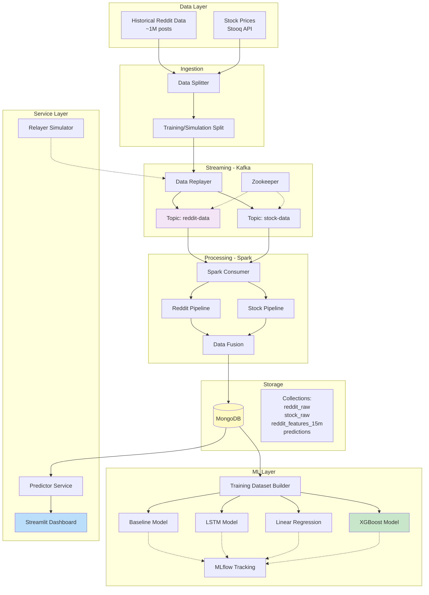
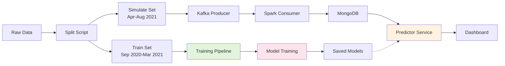

# 📈 Stock Market Prediction using Big Data & Sentiment Analysis

Real-time stock market prediction system combining Reddit sentiment analysis with financial data using modern big data technologies.

[](https://www.python.org/)
[](https://kafka.apache.org/)
[](https://spark.apache.org/)
[](https://www.mongodb.com/)

---

## 📋 Table of Contents
- [Overview](#-overview)
- [Architecture](#-architecture)
- [Tech Stack](#-tech-stack)
- [Project Structure](#-project-structure)
- [Setup & Installation](#-setup--installation)
- [Data Pipeline](#-data-pipeline)
- [ML Models](#-ml-models)
- [Dashboard](#-dashboard)
- [Team](#-team)

---

## 🎯 Overview

This project implements an end-to-end big data pipeline for stock price prediction by analyzing social media sentiment from Reddit's r/wallstreetbets community. The system processes historical data spanning **September 29, 2020 to August 16, 2021**, covering the GameStop short squeeze and the broader meme stock phenomenon, and uses machine learning models to predict stock movements.

### Key Features
- 🔄 **Real-time data streaming** using Kafka
- ⚡ **Distributed processing** with Apache Spark
- 🧠 **Multiple ML models** (Baseline, LSTM, Linear Regression, XGBoost)
- 📊 **Interactive dashboard** with live predictions
- 🎯 **Sentiment analysis** from Reddit posts
- 📈 **Technical indicators** and feature engineering

### Dataset Period
**September 29, 2020 - August 16, 2021** (covering the GameStop squeeze and broader meme stock phenomenon)

### Target Stocks
GME, AMC, TSLA, AAPL, BB, NOK, PLTR, SPCE

---

## 🏗️ Architecture

### System Overview


### Data Flow


---

## 🛠️ Tech Stack

### Big Data Technologies
- **Apache Kafka** - Distributed streaming platform
- **Apache Spark** - Distributed data processing
- **Zookeeper** - Kafka coordination service
- **MongoDB** - NoSQL database for time-series data

### ML & Data Science
- **TensorFlow/Keras** - Deep learning (LSTM models)
- **XGBoost** - Gradient boosting for predictions
- **Scikit-learn** - Classical ML algorithms
- **Pandas & NumPy** - Data manipulation
- **MLflow** - Model tracking and versioning

### Orchestration & Deployment
- **Docker & Docker Compose** - Containerization
- **Apache Airflow** - Workflow orchestration
- **Streamlit** - Interactive dashboard
- **Python 3.11** - Primary language

### APIs & Data Sources
- **Stooq API** - Historical stock prices
- **Reddit/Kaggle** - r/wallstreetbets posts dataset

---

## 📁 Project Structure

```
Stockmarket-Bigdata-Project/
│
├── data/                           # Data directory (gitignored)
│   ├── raw/                        # Original datasets
│   │   ├── reddit_wsb.csv         # ~1M Reddit posts
│   │   └── stock_prices.csv       # Stock OHLCV data
│   ├── train/                      # Training data (Sep 2020-Mar 2021)
│   │   ├── reddit_train.csv
│   │   └── stock_train.csv
│   └── simulate/                   # Simulation data (Apr-Aug 2021)
│       ├── reddit_sim.csv
│       └── stock_sim.csv
│
├── data_collection/                # Data ingestion scripts
│   ├── download_finance_stooq.py  # Stock price downloader
│   ├── split_data.py              # Train/test splitter
│   ├── producer_training_data.py  # Kafka producer
│   ├── spark_consumer.py          # Spark streaming consumer
│   ├── read_kafka_messages.py     # Kafka debugging tool
│   ├── clean_kafka_topics.py      # Topic cleanup utility
│   ├── test_spark.py              # Spark connection test
│   └── verify_datasets.py         # Data validation
│
├── data_processing/                # ETL pipelines
│   ├── reddit_pipeline.py         # Reddit data cleaning
│   ├── stock_pipeline.py          # Stock data processing
│   └── build_training_dataset.py  # Feature engineering
│
├── ml_models/                      # Machine learning models
│   ├── 01_train_baseline_model.ipynb      # Baseline model
│   ├── 02_train_baseline_model.ipynb      # Improved baseline
│   ├── 03_train_LSTM_Model.ipynb          # LSTM deep learning
│   ├── 05_Linear_regression_model.ipynb   # Linear regression
│   ├── 06_XGBoost_model.ipynb             # XGBoost ensemble
│   ├── baseline_model.joblib              # Saved baseline
│   ├── price_predictor_v1.joblib          # Saved predictor v1
│   └── xgboost_reddit_stock_model.pkl     # Saved XGBoost
│
├── orchestration/                  # Application layer
│   ├── airflow_dags/              # Airflow DAG definitions
│   ├── app.py                     # Streamlit dashboard
│   ├── mongo.py                   # MongoDB utilities
│   ├── predictor_service.py       # ML inference service
│   ├── predit.py                  # Prediction helper
│   └── relayer_simulator.py       # Data replay service
│
├── volumes/                        # Docker persistent volumes
│   ├── airflow/
│   │   ├── logs/
│   │   └── plugins/
│   └── mlflow/
│
├── docker-compose.yml             # Service orchestration
├── init-kafka.sh                  # Kafka initialization
├── requirements.txt               # Python dependencies
└── README.md                      # This file
```

---

## 🚀 Setup & Installation

### Prerequisites
- Docker & Docker Compose
- Python 3.11+
- 16GB RAM minimum (for Spark)
- ~10GB disk space

### 1. Clone Repository
```bash
git clone <repository-url>
cd Stockmarket-Bigdata-Project
```

### 2. Install Python Dependencies
```bash
pip install -r requirements.txt
```

### 3. Download Datasets

**Stock Data** (automated):
```bash
python data_collection/download_finance_stooq.py
```

**Reddit Data** (manual):
1. Download from [Kaggle - Reddit WallStreetBets Posts](https://www.kaggle.com/datasets/gpreda/reddit-wallstreetsbets-posts)
2. Place `reddit_wsb.csv` in `data/raw/`

### 4. Verify Data
```bash
python data_collection/verify_datasets.py
```

### 5. Split Data (Train/Simulate)
```bash
python data_collection/split_data.py
```

### 6. Start Infrastructure
```bash
docker-compose up -d
```

### 7. Initialize Kafka Topics
```bash
chmod +x init-kafka.sh
./init-kafka.sh
```

### 8. Verify Services
```bash
# Check all containers are running
docker-compose ps

# Test Spark connection
python data_collection/test_spark.py
```

---

## 🌐 Service URLs

| Service | URL | Credentials | Purpose |
|---------|-----|-------------|---------|
| **Dashboard** | http://localhost:8501 | - | Interactive visualization |
| **Airflow** | http://localhost:8081 | admin / admin | Workflow management |
| **MLflow** | http://localhost:5000 | - | Model tracking |
| **Spark UI** | http://localhost:8080 | - | Spark monitoring |
| **Kafka** | localhost:29092 | - | Message broker |
| **MongoDB** | localhost:27017 | - | Database |

---

## 📊 Data Pipeline

### Step 1: Data Collection
```bash
# Download stock prices from Stooq
python data_collection/download_finance_stooq.py

# Verify dataset integrity
python data_collection/verify_datasets.py
```

### Step 2: Data Splitting
```bash
# Split into training (Sep 2020-Mar 2021) and simulation (Apr-Aug 2021)
python data_collection/split_data.py
```

### Step 3: Start Streaming
```bash
# Start Kafka producer to replay historical data
python data_collection/producer_training_data.py

# Start Spark consumer in another terminal
python data_collection/spark_consumer.py
```

### Step 4: Monitor Pipeline
```bash
# Read Kafka messages for debugging
python data_collection/read_kafka_messages.py

# Check MongoDB collections
python orchestration/mongo.py
```

---

## 🤖 ML Models

### Trained Models

| Model | File | Type | Performance |
|-------|------|------|-------------|
| Baseline | `baseline_model.joblib` | Random Forest | Baseline metrics |
| Linear Regression | `price_predictor_v1.joblib` | Linear | Fast inference |
| XGBoost | `xgboost_reddit_stock_model.pkl` | Ensemble | Best accuracy |
| LSTM | Notebook only | Deep Learning | Sequential patterns |

### Training Pipeline

1. **Build Training Dataset**
   ```bash
   python data_processing/build_training_dataset.py
   ```

2. **Train Models** (run Jupyter notebooks)
   ```bash
   jupyter notebook ml_models/
   ```
   - `01_train_baseline_model.ipynb` - Random Forest baseline
   - `03_train_LSTM_Model.ipynb` - LSTM for time series
   - `05_Linear_regression_model.ipynb` - Linear regression
   - `06_XGBoost_model.ipynb` - XGBoost ensemble

3. **Track with MLflow**
   ```bash
   # MLflow automatically tracks experiments
   # View at http://localhost:5000
   ```

### Feature Engineering
- **Stock Features**: OHLCV, returns, volatility, moving averages
- **Reddit Features**: Post count, sentiment scores, engagement metrics
- **Time Features**: Hour, day of week, market hours
- **Technical Indicators**: RSI, MACD, Bollinger Bands

---

## 📈 Dashboard

### Launch Dashboard
```bash
streamlit run orchestration/app.py
```

### Features
- 📊 **Real-time Overview** - Current prices, changes, Reddit activity
- 📈 **Stock Analysis** - Candlestick charts, volume, returns
- 💬 **Reddit Activity** - Post frequency, sentiment trends
- 🔗 **Correlation Analysis** - Reddit sentiment vs stock movements
- 🤖 **Predictions** - ML model forecasts with accuracy metrics
- 🔄 **Auto-refresh** - Updates every 30 seconds

### Dashboard Tabs
1. **Overview** - Key metrics and combined visualization
2. **Stock Analysis** - Price charts, volume, returns
3. **Reddit Activity** - Post frequency and engagement
4. **Correlation** - Heatmaps showing relationships
5. **Predictions** - Model predictions and accuracy

---

## 🔧 Utilities & Scripts

### Kafka Management
```bash
# Clean all Kafka topics
python data_collection/clean_kafka_topics.py

# Read messages from topics
python data_collection/read_kafka_messages.py
```

### Data Validation
```bash
# Verify dataset completeness
python data_collection/verify_datasets.py

# Test Spark connectivity
python data_collection/test_spark.py
```

### MongoDB Operations
```bash
# MongoDB utilities and queries
python orchestration/mongo.py
```

---

## 📊 Dataset Details

### Time Period
- **Full Dataset**: September 29, 2020 - August 16, 2021 (10.5 months)
- **Training**: September 2020 - March 2021 (6 months)
- **Simulation/Testing**: April 2021 - August 2021 (4.5 months)
- **Historical Context**: GameStop short squeeze (Jan 2021) and meme stock era

### Data Volume
- **Reddit Posts**: ~1,000,000 posts from r/wallstreetbets
- **Stock Records**: ~1,000 daily OHLCV records per ticker
- **Total Tickers**: 8 stocks (GME, AMC, TSLA, AAPL, BB, NOK, PLTR, SPCE)

### MongoDB Collections
- `reddit_raw` - Raw Reddit posts
- `stock_raw` - Raw stock prices
- `reddit_features_15m` - Aggregated 15-minute Reddit features
- `predictions` - Model predictions and evaluation metrics

---

## 🎓 Academic Context

**Course**: Big Data & Applications 2025-2026  
**Professor**: Yasser El Madani El Alami  
**Institution**: ISMAGI

---

## 👥 Team Members

| Member | Role | Responsibilities |
|--------|------|------------------|
| **Member 1** | Data Collection Engineer | Data acquisition, Kafka setup, producers |
| **Member 2** | Data Processing Engineer | Spark pipelines, ETL, data cleaning |
| **Member 3** | ML Engineer | Model training, feature engineering, MLflow |
| **Member 4** | Integration Engineer | Dashboard, orchestration, deployment |

---

## 🚦 Project Status

### ✅ Completed
- [x] Docker infrastructure (Kafka, Spark, MongoDB, Airflow, MLflow)
- [x] Data collection scripts (Stock + Reddit)
- [x] Historical data download (Jan-Jun 2021)
- [x] Data splitting (train/simulate)
- [x] Kafka topics and producers
- [x] Spark streaming consumer
- [x] MongoDB storage schema
- [x] Reddit & Stock processing pipelines
- [x] Feature engineering pipeline
- [x] Multiple ML models (Baseline, Linear, XGBoost, LSTM)
- [x] Streamlit dashboard with 5 tabs
- [x] Predictor service
- [x] Auto-refresh functionality

### 🔄 In Progress
- [ ] Airflow DAG automation
- [ ] Model performance optimization
- [ ] Real-time prediction inference
- [ ] Advanced sentiment analysis

### 📋 Future Enhancements
- [ ] Deploy to cloud (AWS/GCP)
- [ ] Add more tickers
- [ ] Implement reinforcement learning
- [ ] Real-time Twitter sentiment
- [ ] Backtesting framework

---

## 🐛 Troubleshooting

### Common Issues

**Kafka not starting**
```bash
docker-compose down -v
docker-compose up -d
./init-kafka.sh
```

**Spark consumer errors**
```bash
# Check Spark is running
python data_collection/test_spark.py

# Check Kafka has messages
python data_collection/read_kafka_messages.py
```

**MongoDB connection issues**
```bash
# Restart MongoDB
docker-compose restart mongo

# Verify connection
python orchestration/mongo.py
```

**Dashboard not showing data**
```bash
# Verify MongoDB has data
python orchestration/mongo.py

# Clear cache and refresh
# Click "Refresh Data" in sidebar
```

---

## 📚 References

- [Apache Kafka Documentation](https://kafka.apache.org/documentation/)
- [Apache Spark Streaming Guide](https://spark.apache.org/docs/latest/streaming-programming-guide.html)
- [MongoDB Time Series Collections](https://www.mongodb.com/docs/manual/core/timeseries-collections/)
- [Streamlit Documentation](https://docs.streamlit.io/)
- [XGBoost Documentation](https://xgboost.readthedocs.io/)

---

## 📄 License

This project is developed for academic purposes as part of the Big Data & Applications course.

---

## 🙏 Acknowledgments

- Professor Yasser El Madani El Alami for guidance
- r/wallstreetbets community for the interesting case study
- Kaggle for providing the Reddit dataset
- Stooq for stock market data API

---

**Last Updated**: January 2026  
**Version**: 1.0.0

---

For questions or issues, please contact the team members or create an issue in the repository.
